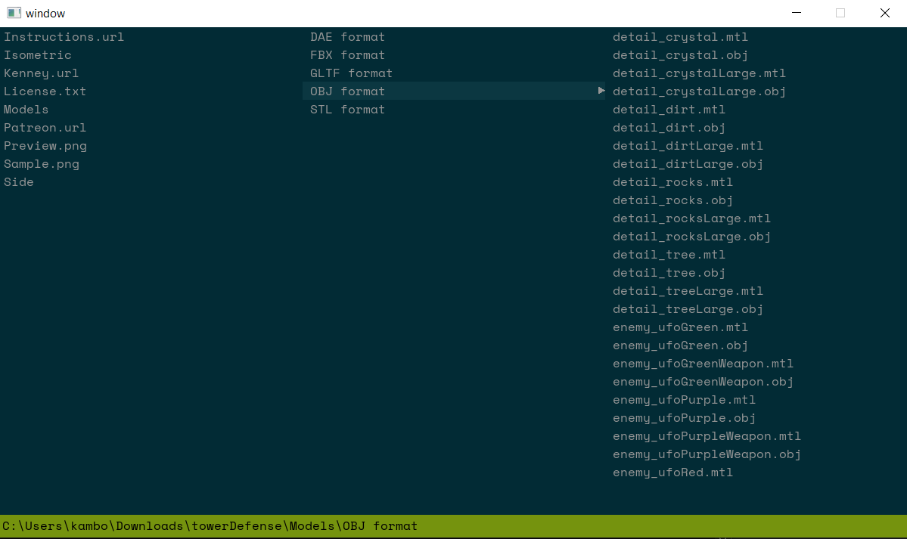
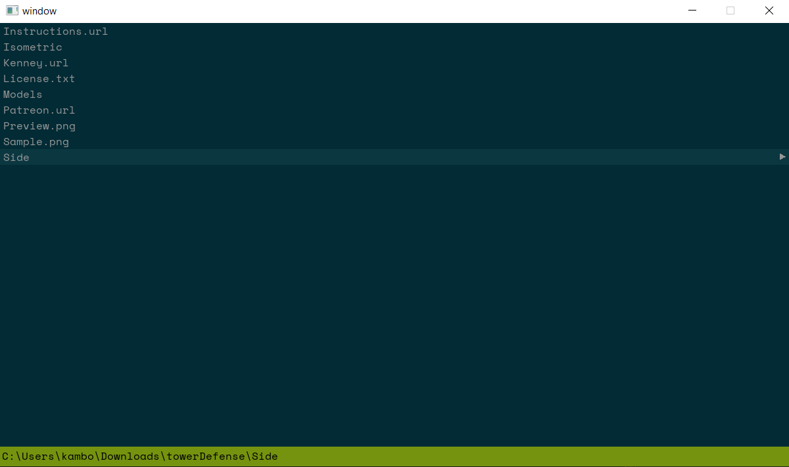
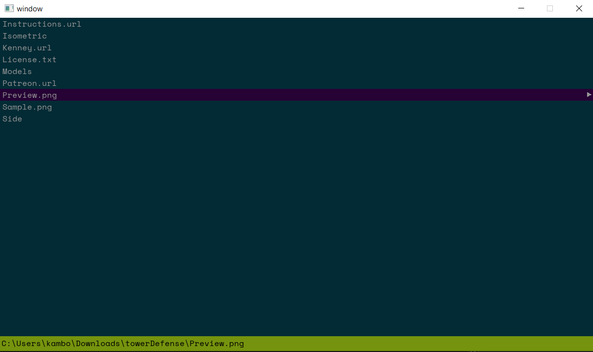
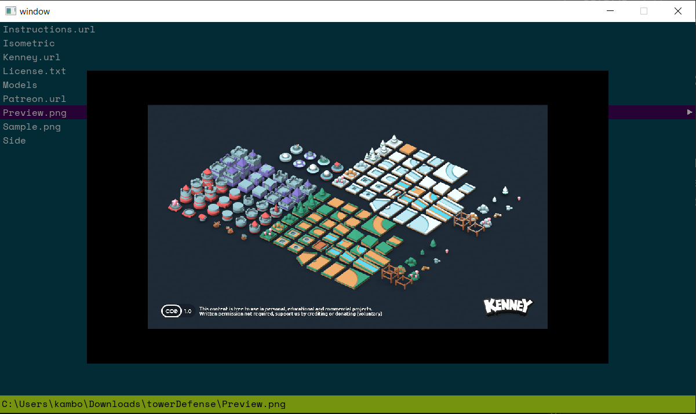
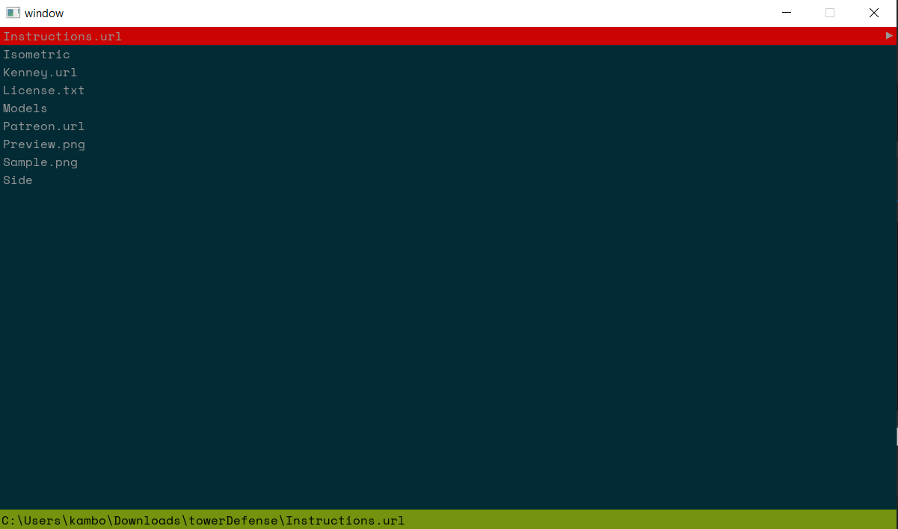

# File Browser

This a file browser created with SDL2, inspired by NERDTree.

## Overview

The goal of this project was to learn the fundamentals of SDL2 and become acquainted with developing real-time applications from scratch. The notion of creating a file browser was inspired by NERDTree, which is a popular VIM-based file explorer.

## Programming Language

C++

## Features Developed

-   real-time input
-   keyboard shortcut
-   file path display
-   image preview for PNG, JPG, TIFF, and WEBP
-   error display for inaccessible folders
-   ability to have multiple directories open at once but only see 3 at a time
-   vertical scrolling
-   real-time directory view updating

## Demo

## Images

<figcaption>Multiple directories open at once</figcaption>

<figcaption>Folder selected</figcaption>

<figcaption>Image selected</figcaption>

<figcaption>Image preview</figcaption>

<figcaption>File or folder not accessible</figcaption>

